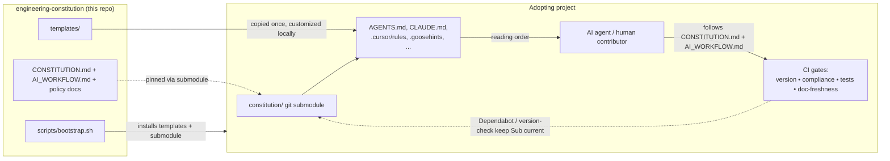

# Eric's Engineering Constitution

Eric's Engineering Constitution is a reusable framework for AI-assisted software development standards. It is the single source of truth for how humans and AI agents should work across your software repositories.

Each project includes this repository as a `constitution/` Git submodule alongside a small set of local project files, giving every project:

- Shared engineering principles
- Standard AI-agent workflow instructions
- Baseline templates for README, TODO, CHANGELOG, AGENTS, Claude, Copilot, and ADR files
- A standardized "Eric's Engineering Constitution" adoption badge in the README
- A bootstrap script that installs those files into an existing Git repository

## Repository Contents

- `CONSTITUTION.md`: Authoritative engineering principles.
- `AI_WORKFLOW.md`: Step-by-step AI agent workflow.
- `INTEGRATION.md`: Submodule workflow, agent reading order, project-specific overrides, and VERSION update strategy.
- `TESTING.md`: Testing expectations and reporting standards.
- `DOCUMENTATION.md`: Documentation requirements and checklists.
- `SECURITY.md`: Security review standards.
- `OPERATIONS.md`: Operations and infrastructure standards.
- `ARCHITECTURE.md`: Architecture and ADR expectations.
- `RELEASES.md`: Release and changelog standards.
- `TODO_GUIDELINES.md`: TODO.md structure and maintenance rules.
- `KNOWLEDGE_SOURCES.md`: How to drop in book/reference sources and turn them into agent-consumable summaries via `sources/`.
- `templates/`: Files to copy into projects.
- `templates/docs/PRODUCT_REQUIREMENTS.md`: Optional product requirements template.
- `templates/docs/MVP_BACKLOG.md`: Optional milestone backlog template for early-stage products.
- `examples/sample-project/`: Example project layout.
- `examples/OPERATIONS.example.md`: Fully worked `docs/OPERATIONS.md` runbook for a deployed service.
- `scripts/bootstrap.sh`: Script to initialize an existing repository.
- `scripts/check_traceability.sh`: Reference checker that verifies every requirement ID has a verifying-test entry in the traceability matrix.
- `scripts/check_compliance.sh`: Reference checker that verifies an adopting repository carries the expected governance files.
- `scripts/check_version_alignment.sh`: Reference checker that verifies adopter-facing Constitution version references match the pinned `constitution/VERSION`.
- `scripts/check_release_tag_alignment.sh`: Source-repo checker that verifies `VERSION`, the matching `v<VERSION>` tag, and `HEAD` stay aligned after a release.
- `scripts/run_declared_tests.sh`: Runs the test command an adopting repository declares in `docs/TEST_PLAN.md`, enforcing it in CI.
- `scripts/check_doc_freshness.sh`: Blunt CI tripwire that flags a pull request changing source files without touching README.md/CHANGELOG.md.

## Project Structure

```text
engineering-constitution/
├── CONSTITUTION.md                       ← Authoritative engineering principles (start here)
├── AI_WORKFLOW.md                        ← Required step-by-step AI agent workflow
├── INTEGRATION.md                        ← Submodule workflow, agent reading order, multi-tool setup
├── TESTING.md                            ← Testing expectations, coverage, CI enforcement
├── DOCUMENTATION.md                      ← Documentation requirements and README/CHANGELOG standards
├── SECURITY.md                           ← Security review standards
├── OPERATIONS.md                         ← Operations and infrastructure standards
├── ARCHITECTURE.md                       ← Architecture, ADR, and visual-diagram expectations
├── RELEASES.md                           ← Versioning, changelog, and release-cutting standards
├── TODO_GUIDELINES.md                    ← TODO.md structure and maintenance rules
├── KNOWLEDGE_SOURCES.md                  ← How to drop in reference sources under sources/
├── VERSION                               ← Single source of truth for the framework's version
├── README.md / TODO.md / CHANGELOG.md    ← This repository's own governance docs
├── AGENTS.md, CLAUDE.md, COPILOT_INSTRUCTIONS.md, ...  ← This repo's own agent instructions
│
├── templates/                            ← Files scripts/bootstrap.sh copies into adopting projects
│   ├── docs/                             ← docs/ templates (ARCHITECTURE, SETUP, TEST_PLAN, ADR, ...)
│   └── .github/
│       ├── workflows/                    ← CI gate templates (version, compliance, tests, doc-freshness)
│       └── agents/                       ← Solon, the Copilot custom agent
│
├── scripts/                              ← bootstrap.sh plus every checker, auditor, and its tests
├── examples/                             ← A worked sample-project layout + OPERATIONS.example.md
├── sources/                              ← Book/reference sources distilled into agent-consumable summaries
├── mcp-server/                           ← MCP server exposing constitution docs/sources as resources
└── wiki/                                 ← Wiki content (Home.md)
```

`INTEGRATION.md`'s "Project File Structure" section shows the mirror image of this: what an **adopting** project looks like once it pulls this repository in as a `constitution/` submodule.

## How It Works



Every adopting project pulls this repository in as a read-only `constitution/` submodule, layers a small set of local files on top (agent entry points, tool-specific rule files, CI workflows), and lets AI agents and CI gates enforce the same standards documented here — see `INTEGRATION.md` for the full reading order and multi-tool setup.

## Version

Current version: 1.30.0

See `VERSION`.

## Getting Started

### Step 1: Publish This Repository

Publish this repository somewhere your projects can access it:

```bash
cd /path/to/engineering-constitution
git remote add origin <repository-url>
git push -u origin main
```

Use that `<repository-url>` in the bootstrap commands below.

### Step 2: Bootstrap a Project

Run the bootstrap script to set up the constitution in any Git repository:

```bash
./scripts/bootstrap.sh /path/to/project <repository-url>
```

The target project must already be a Git repository. Pass `--force` to overwrite previously generated files:

```bash
./scripts/bootstrap.sh --force /path/to/project <repository-url>
```

#### New Repository

```bash
mkdir my-project
cd my-project
git init
cd /path/to/engineering-constitution
./scripts/bootstrap.sh /path/to/my-project <repository-url>
```

Customize the generated files (`README.md`, `TODO.md`, `CHANGELOG.md`, `docs/adr/0001-record-architecture-decisions.md`), then commit:

```bash
cd /path/to/my-project
git add .
git commit -m "Add Eric's engineering constitution"
```

#### Existing Repository

```bash
./scripts/bootstrap.sh /path/to/existing-project <repository-url>
```

The script adds the `constitution` submodule, creates missing governance files, and writes an adoption report to `.constitution-bootstrap/adoption-report.md`. Existing files are never overwritten by default — template copies are placed in `.constitution-bootstrap/templates/` for manual merging.

After running it:

1. Review `.constitution-bootstrap/adoption-report.md` for detected project context and recommended merge steps.
2. Merge any relevant template content into skipped files.
3. Customize generated placeholders.
4. Commit `.gitmodules`, the `constitution` submodule reference, generated files, and any merged changes.

### Adoption Badge

Every repository the bootstrap script touches gets a standardized adoption badge in its `README.md`:

```markdown
<!-- CONSTITUTION_START -->
[](https://github.com/esanacore/engineering-constitution)
<!-- CONSTITUTION_END -->
```

The badge is managed between the `CONSTITUTION_START` / `CONSTITUTION_END` markers, so it is added to existing READMEs (after the first heading), refreshed in place when the constitution is updated, and never duplicated on re-runs. The badge link points at the bootstrap source when it is a public Git URL and falls back to the canonical repository otherwise.

### Manual Installation

If you prefer not to use the bootstrap script:

```bash
git submodule add <repository-url> constitution
cp constitution/templates/AGENTS.md AGENTS.md
cp constitution/templates/CLAUDE.md CLAUDE.md
