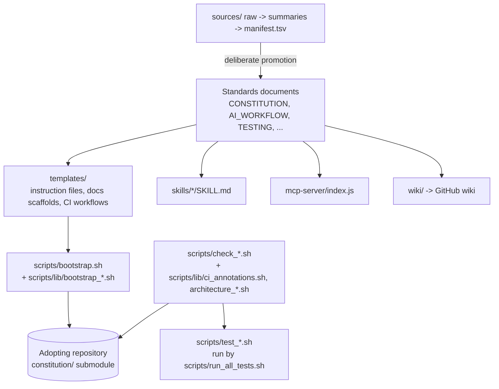

# Architecture

This document describes how Eric's Engineering Constitution Framework itself is
put together. The standards it ships for *adopters'* architecture live in the
root `ARCHITECTURE.md`; this file is the framework applying that standard to
its own repository.

## System Overview

The framework is a Git repository that adopting projects pull in as a read-only
`constitution/` submodule. It has no runtime of its own beyond bash and Git.
Its pieces are:

- **Standards documents** at the root (`CONSTITUTION.md`, `AI_WORKFLOW.md`,
  `TESTING.md`, ...) — the rules, read by humans and AI agents.
- **Templates** under `templates/` — files `scripts/bootstrap.sh` copies into
  an adopting repository: instruction files, `docs/` scaffolds, CI workflows.
- **Governance checkers** under `scripts/` — zero-dependency bash scripts that
  verify an adopter (or this repository) actually follows the rules, each with
  a paired negative-case test suite.
- **Skills** under `skills/` — agent skill definitions that execute
  constitution rules autonomously in tools that load `SKILL.md` files.
- **An MCP server** under `mcp-server/` — exposes the standards and knowledge
  source summaries as resources to any MCP-connected agent.
- **Knowledge sources** under `sources/` — the intake path by which outside
  books and articles influence the standards deliberately.
- **A wiki** under `wiki/` — the high-altitude catalogue, published to the
  GitHub wiki on merge.

## Component Diagram

## Data Flow

1. A maintainer edits a standards document, template, or checker on a branch
   and opens a pull request. `.github/workflows/tests.yml` runs every
   `scripts/test_*.sh` through `scripts/run_all_tests.sh` and runs the
   checkers against this repository (`self-governance` job).
2. On merge to `main`, `.github/workflows/wiki-sync.yml` publishes `wiki/` to
   the GitHub wiki. A release bumps `VERSION`, tags `vX.Y.Z`, and
   `release-tag-alignment.yml` proves the three agree.
3. An adopter's Dependabot opens a submodule-bump pull request; its
   `constitution-version.yml` gate stays red until the bump merges. The
   adopter's other `constitution-*.yml` workflows invoke the checkers from the
   pinned submodule on every pull request.

## Key Technologies

- **Language**: bash (POSIX-leaning, `set -euo pipefail`), awk, sed, Git. No
  interpreter beyond what a CI runner or developer machine already has.
- **MCP server**: Node.js with `@modelcontextprotocol/sdk` (the framework's
  only third-party runtime dependency; see `docs/OTS_SOFTWARE.md`).
- **Diagrams**: Mermaid source with a pre-rendered SVG for the README hero
  image (`assets/diagrams/`).

## Repository Structure

See `README.md`'s "Project Structure" tree for the annotated top-level layout.

## Layer Boundaries

The framework is bash and Markdown, which `scripts/check_architecture.sh` does
not parse for imports, so Dependency Rule enforcement is not turned on here.
The structural rule this repository does enforce is the sourced-library split:
`scripts/*.sh` are entry points (committed `100755`), `scripts/lib/*.sh` are
definitions only (committed `100644`, sourced, never executed), and
`scripts/test_checker_contract.sh` fails the build if either drifts.
